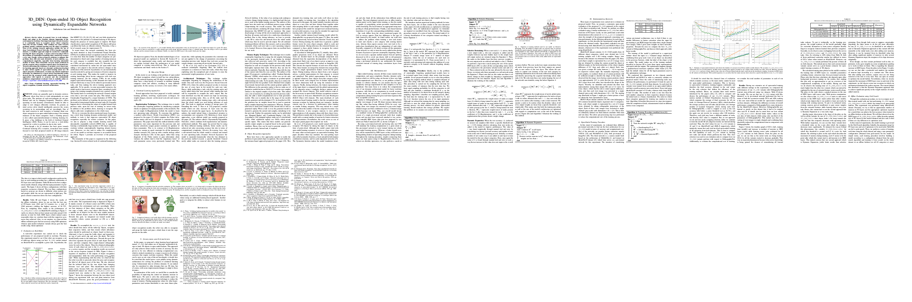

## 3D_DEN: Open-ended 3D Object Recognition using Dynamically Expandable Networks
This project hosts the code for our [**IEEE TCDS** paper](https://ieeexplore.ieee.org/document/9410594)  


  An overview of the proposed 3D_DEN model: Initially, three representative views are chosen from a set of multi-view images for a given 3D object.Then, each of them is converted to a single channel (grey-scale) image and later merged to form a 3-channel image. Now, this image is fed to a pre-trained network, and the extracted features are flattened. Finally, we attach two DEN layers to the model which give the output.

<!---
##
- Major parent papers that inspired our work are : [DEN](https://openreview.net/pdf?id=Sk7KsfW0-) and [OrthographicNet](https://arxiv.org/pdf/1902.03057.pdf)
- Video demo using a real-time robot can be found [here](https://youtu.be/tf4trRMyQ0Y).
-->

## Requirements:
- Python 3.6
- Kindly create a virtual environment using requirements.txt file to run the code  
- **Note:** For Offline Evaluation using GridSearch, use Tensorflow and Tensorboard version: 2.3.0.

## Paper 
Latest version available on [arXiv](https://arxiv.org/abs/2009.07213) (March 2021) | [Video](https://youtu.be/tf4trRMyQ0Y) | [Report](https://fse.studenttheses.ub.rug.nl/23621/1/SJ_Graduation_Thesis_Final_submission.pdf)  



Please adequately refer to the paper any time this code is being used. If you do publish a paper where 3D_DEN helped your research, we encourage you to cite the following paper in your publications:

```bib
@ARTICLE{jain-3dden-2021,
  author={Jain, Sudhakaran and Kasaei, Hamidreza},
  journal={IEEE Transactions on Cognitive and Developmental Systems}, 
  title={3D_DEN: Open-ended 3D Object Recognition using Dynamically Expandable Networks}, 
  year={2021},
  doi={10.1109/TCDS.2021.3075143}
}
```

## Authors: 
[Sudhakaran Jain](https://sudhakaranjain.github.io/) and [Hamidreza Kasaei](https://hkasaei.github.io/)  
Work done while at [RUG](https://www.rug.nl/).
