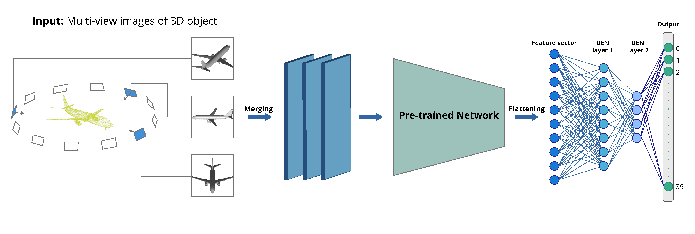

## 3D_DEN: Open-ended 3D Object Recognition using Dynamically Expandable Networks

  An overview of the proposed 3D_DEN model: Initially, three representative views are chosen from a set of multi-view images for a given 3D object.Then, each of them is converted to a single channel (grey-scale) image and later merged to form a 3-channel image. Now, this image is fed to a pre-trained network, and the extracted features are flattened. Finally, we attach two DEN layers to the model which give the output.


  
## 
<!---
- This project hosts the code for our [**3D_DEN** paper](https://arxiv.org/pdf/2009.07213.pdf) and [report](https://fse.studenttheses.ub.rug.nl/23621/1/SJ_Graduation_Thesis_Final_submission.pdf)
- Major parent papers that inspired our work are : [DEN](https://openreview.net/pdf?id=Sk7KsfW0-) and [OrthographicNet](https://arxiv.org/pdf/1902.03057.pdf)
- Video demo using a real-time robot can be found [here](https://youtu.be/tf4trRMyQ0Y).
-->

## Requirements:
- Python 3.6
- Kindly create a virtual environment using requirements.txt file to run the code  
- **Note:** For Offline Evaluation using GridSearch, use Tensorflow and Tensorboard version: 2.3.0.

## Paper
Latest version available on [arXiv](https://arxiv.org/abs/2009.07213) (March 2021) | [Video](https://youtu.be/tf4trRMyQ0Y)


Please adequately refer to the papers any time this code is being used. If you do publish a paper where 3D_DEN helped your research, we encourage you to cite the following paper in your publications:

```text
@article{jain20203d_den,
  title={3D\_DEN: Open-ended 3D Object Recognition using Dynamically Expandable Networks},
  author={Jain, Sudhakaran and Kasaei, Hamidreza},
  journal={arXiv preprint arXiv:2009.07213},
  year={2020}
}
```

## Authors: 
[Sudhakaran Jain](https://sudhakaranjain.github.io/) and [Hamidreza Kasaei](https://hkasaei.github.io/)  
Work done while at [RUG](https://www.rug.nl/).
